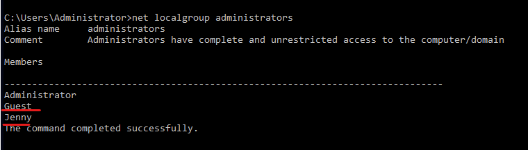

# Page

Whats the version and year of the windows machine?\


<div align="left">

<figure><figcaption></figcaption></figure>

</div>

Which user logged in last?\


```powershell
quser
```

When did John log onto the system last?

Answer format: MM/DD/YYYY H:MM:SS AM/PM

```powershell

Get-WinEvent -LogName Security -FilterXPath '*/System/EventID=4624 and */EventData/Data[@Name="TargetUsername"]="John"'
e=John'
```

<figure><figcaption></figcaption></figure>

What IP does the system connect to when it first starts?\


What two accounts had administrative privileges (other than the Administrator user)?

Answer format: username1, username2


Whats the name of the scheduled task that is malicous.\


What file was the task trying to run daily?\


What port did this file listen locally for?\


When did Jenny last logon?\


At what date did the compromise take place?

Answer format: MM/DD/YYYY


During the compromise, at what time did Windows first assign special privileges to a new logon?

Answer format: MM/DD/YYYY HH:MM:SS AM/PM


What tool was used to get Windows passwords?\


Submit

What was the attackers external control and command servers IP?\


Submit

What was the extension name of the shell uploaded via the servers website?\


Submit

What was the last port the attacker opened?\


SubmitHint

Check for DNS poisoning, what site was targeted?
